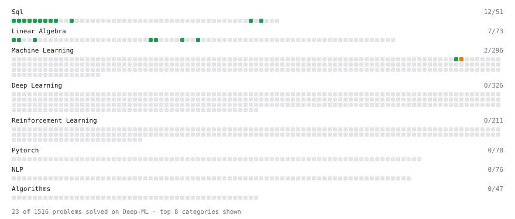

# Deep-ML

My machine learning practice from [Deep-ML](https://www.deep-ml.com). Every solution here was written by hand.

**18** solved · 14 problems · 0 labs · 4 math

[**Browse the interactive portfolio**](https://asparagusD.github.io/deep-ml-solutions/) to replay this filling in over time.

## Problems

| | Difficulty | Solved | |
| --- | --- | --- | --- |
| [Average per group](https://www.deep-ml.com/problems/1108) | easy | 2026-09-28 | [solution](problems/1108-average-per-group) |
| [Count rows per group](https://www.deep-ml.com/problems/1107) | easy | 2026-09-28 | [solution](problems/1107-count-rows-per-group) |
| [Customers Who Never Placed an Order](https://www.deep-ml.com/problems/1460) | easy | 2026-09-28 | [solution](problems/1460-customers-who-never-placed-an-order) |
| [Delete Duplicate Emails Keeping One](https://www.deep-ml.com/problems/1112) | easy | 2026-09-28 | [solution](problems/1112-delete-duplicate-emails-keeping-one) |
| [Derivative of a Polynomial](https://www.deep-ml.com/problems/116) | easy | 2026-05-26 | [solution](problems/0116-derivative-of-a-polynomial) |
| [Filter rows with WHERE](https://www.deep-ml.com/problems/1103) | easy | 2026-09-28 | [solution](problems/1103-filter-rows-with-where) |
| [Monthly Average Product Rating](https://www.deep-ml.com/problems/1249) | easy | 2026-09-28 | [solution](problems/1249-monthly-average-product-rating) |
| [Remove duplicates with DISTINCT](https://www.deep-ml.com/problems/1105) | easy | 2026-09-28 | [solution](problems/1105-remove-duplicates-with-distinct) |
| [SELECT all rows](https://www.deep-ml.com/problems/1101) | easy | 2026-09-27 | [solution](problems/1101-select-all-rows) |
| [Select specific columns](https://www.deep-ml.com/problems/1102) | easy | 2026-09-27 | [solution](problems/1102-select-specific-columns) |
| [Sort results with ORDER BY](https://www.deep-ml.com/problems/1104) | easy | 2026-09-28 | [solution](problems/1104-sort-results-with-order-by) |
| [Top N with LIMIT](https://www.deep-ml.com/problems/1106) | easy | 2026-09-28 | [solution](problems/1106-top-n-with-limit) |
| [Your first JOIN](https://www.deep-ml.com/problems/1109) | easy | 2026-09-28 | [solution](problems/1109-your-first-join) |
| [Product Rule for Derivatives](https://www.deep-ml.com/problems/309) | medium | 2026-05-26 | [solution](problems/0309-product-rule-for-derivatives) |

## Math

| | Difficulty | Solved | |
| --- | --- | --- | --- |
| [Derivatives and Gradients](https://www.deep-ml.com/math-problems/1) | easy | 2026-09-27 | [solution](math/0001-derivatives-and-gradients) |
| [Matrix Basics](https://www.deep-ml.com/math-problems/9) | easy | 2026-10-08 | [solution](math/0009-matrix-basics) |
| [Vector Operations](https://www.deep-ml.com/math-problems/7) | easy | 2026-09-23 | [solution](math/0007-vector-operations) |
| [Matrix Multiplication](https://www.deep-ml.com/math-problems/10) | medium | 2026-10-08 | [solution](math/0010-matrix-multiplication) |

---

_This file is regenerated by Deep-ML on every push._
